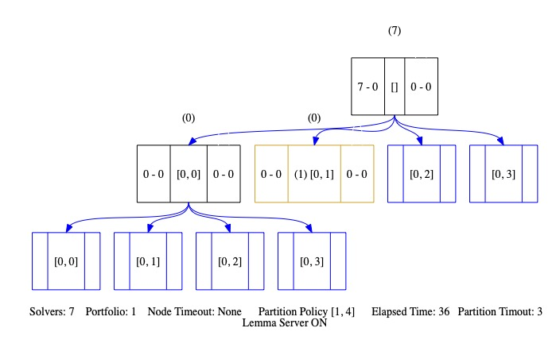

[](https://opensource.org/licenses/MIT) [](https://gitter.im/usi-verification-and-security/smts?utm_source=badge&utm_medium=badge&utm_campaign=pr-badge&utm_content=badge)
# SMTS
### Cloud and Parallel Solver
[SMTS](https://verify.inf.usi.ch/smts) is a framework for organising and visualizing executions of SMT and PDR in distributed computing environments.  The design is based on a general parallelization technique that supports recursively combining algorithm portfolios and divide-and-conquer with the exchange of learned information. The system is a client-server architecture that communicates with a custom protocol over TCP IP. New features for 2022 include the complete implementation of the partition tree protocol with clause sharing. On a high level the parallel solver partitions the instance dynamically on-demand and allows clauses to be shared between solvers working on different instances whenever this is allowed based on the information in the solvers. The dynamic partitioning is implemented as an iteration in a tree of consisting of partitioned instances, and the instances in inner nodes are considered equally to those in the leaves. This aproach guarantees under reasonable assumptions on the instance’s run time distribution that the parallel solver will not be slower than the sequential solver. For a fair and load-balanced scheduling of solving of the partitions, the solvers are distributed over the instances on parameters such as whether the instance has already been attempted, how many solvers are working on the instance, and how deep in the tree the instance is. We have entered two versions of the solver to the cloud and parallel tracks: SMTS portfolio which randomises the SAT solver by choosing 2% of the decision variables randomly; and SMTS cube-and-conquer, which uses the parallelization tree approach to implement a version of search-space-partitioning.


Project page: http://verify.inf.usi.ch/smts

### External dependencies
The SMTS project automatically downloads and builds two external dependencies, namely 'opensmt2' and 'ptplib,' utilizing CMake and handling the entire process of downloading and configuring.
- SMT solver [OpenSMT](https://github.com/usi-verification-and-security/opensmt.git) which is equipped with a flexible interpolation framework for EUF and LRA for computing function summaries. UpProver is implemented in C++. It allows verifying user-specified assertions within a predefined bound. 
SMTS supports reading files in SMT-LIB2 format and the theories QF_UF, QF_RDL, QF_IDL, QF_LRA, QF_LIA, QF_UFLRA, QF_UFLIA and QF_AX.,
since 2008.
- [ptplib](https://github.com/usi-verification-and-security/ptplib ), partition tree protocol, as a way of organizing
the solving of monotonic logics by combining divide-and-conquer parallelism, algorithm portfolio, and lemma sharing.

#### Cloud and Parallel
 - [aws-smts](https://github.com/usi-verification-and-security/aws-smts), contains Dockerfiles and Scripts that build and run the SMTS on aws infrastructure.

- It runs on our parallelization infrastructure described in [repository](https://github.com/usi-verification-and-security/opensmt-debugging).


## Building from source

To build the system from the source code repository, you need a C++17
compliant compiler and the following libraries and headers installed:

 - gmp
 - libedit or readline (optional)

In addition the `smtlib2` parser uses `flex` and `bison`.
SMTS uses `cmake` as a build system generator. To compile SMTS's client and the Lemma Server (using `make` build system), use the following
command
```
$ mkdir build; cd build; cmake ..; make
```

### Changing build type
The default build type is RELEASE. Different build types can be configured using cmake variable CMAKE_BUILD_TYPE. For example, to create a debug build use
```
$ cmake -DCMAKE_BUILD_TYPE=Debug ..
```

Usage
=====
### Parallization Server
To see all the Parallization Server's Options, type `./smts.py --help`.

General Options:
- `-h`, `--help`: Display the help message and exit.
- `-v`, `--version`: Show the program's version number and exit.
- `-fp <FILE_PATHS>`: Provide file paths.
- `-g`: Run the GUI in live mode. 
- `-el`: Enable system- -wide logging.

Partitioning:
- `-pt N`: Set the partition timeout.
- `-nt N`: Set the node timeout.
- `-p`: Enable partitioning.

Lemma Sharing:
- `-l`: Enable lemma sharing.
- `-D`: Store lemmas in the database.
- `-r`: Send the same lemmas multiple times to the solver.

Solvers:
- `-o N`: Run N opensmt2 solvers.
- `-z N`: Run N z3spacer solvers. currently not supported.
- `-s N`: Run N sally solvers.  currently not supported.
- `-pn N`: Set the port number.


#### Lemma Server
To run the Lemma Server, navigate to `build` and run:
`./lemma_server -s127.0.0.1:3000`
#### Solver Client
To run the solver client, navigate to `build` and run:
`./solver_opensmt -s127.0.0.1:3000`
### Client

To send a smt2 script to the Parallization server:
 `cd server`
`./client.py 3000 /example.smt2`

Feel free to use these options to configure and customize the behavior of the SMTS server according to your requirements.

#### Visualization Tree 
SMTS draws a partition tree when timout reached based on incoming event from the solvers:

Set `visualize_tree = True` within `server/config/default.py`.


#### SMTS participated in:
Cloud and Parallel tracks for [SMT-COMP 21](https://smt-comp.github.io/2021/parallel-and-cloud-tracks.html) and [SMT-COMP 22](https://smt-comp.github.io/2022/parallel-and-cloud-tracks.html) .

Contact
=====
If you have questions please mail them to me at
masoud.asadzade@gmail.com, or to the discussion forum!
